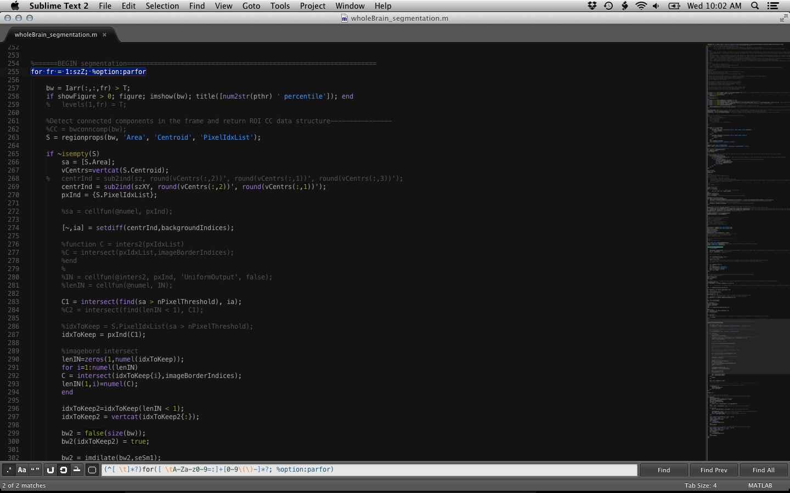

Author: James B. Ackman  
Date: 2013-07-03 12:16:50  

# wholeBrainDX

Image analysis software for whole brain calcium imaging movies (Ackman et al. 2012-2014). Please refer to:  

Ackman JB, Zeng H, Crair MC. 2014. Structured dynamics of neural activity across developing neocortex. [bioRxiv doi: 10.1101/123456](http://www.biorxiv.org/content/early/2014/12/05/012237)

Usage instructions at [wholeBrain_workflow.md](wholeBrain_workflow.md)

# Installation

1. Clone wholeBrainDX from GitHub into your *$MATLABHOME* user folder.
2. Add wholeBrainDX to your [matlab path][matlabSearchPath]
3. Install the core dependency toolboxes. Add them your matlab search path or use the `addpath(genpath('$PATH/$MATLABHOME/toolbox'))` syntax at the command prompt when starting up matlab with each toolbox.
4. *Optional:* Install the non-core dependency toolboxes. Same as above, add their folders and subfolders to your matlab path.

# Requirements

## Core dependencies ##

* matlab with the image processing and signal processing toolboxes.
* [piotrImageVideoProcessingToolbox][piotrToolbox]. Uses gaussSmooth and xcorrn from this toolbox.

## Non-core dependencies ##

* [FFmpeg](https://www.ffmpeg.org). Highly recommended for writing videos (otherwise the matlab builtin function videoWriter is used which will likely be slower). The executable should be 'ffmpeg' and should either be in your matlab search path (windows or mac/unix) or in your system shell path (mac/unix, edit the .bashrc file after install).
* [sigTOOL][sigtool]. Used with the stimulus movies workflow and dealing with motor signals. This program is useful if going to use simultaneously acquired electrophysiology, stimulation data stored in a data format readable by sigtool, such as CED Spike2 .smr files. This toolbox will read those files and output a .kcl matlab data structure file format.
* **parfor** loop replacement. Replace `for` with `parfor` loops in a few files for *possibly* increased processing speed. Useful if using an HPC cluster or computers with multiple (>=8?) cpus.
    * To use parfor, use grep (regular expression) find/replacement in a text editor on all files in wholeBrainDX (should find matches among several files):
    * Find: `(^[ \t]*?)for([ \tA-Za-z0-9=:]+[A-Za-z0-9\(\)-]*?; %option:parfor)`
    * Replace: `\1parfor\2`

* [bfmatlab](http://www.openmicroscopy.org/site/support/bio-formats5/users/matlab/index.html), a matlab toolbox containing the bio-formats java plugin and a `bfopen.m` reader function for opening many different microscopy image/tiff file formats. Useful if opening multichannel data or a non-standard tiff or image file format that matlab's builtin `imread` can't handle.
* [CalciumDX](https://github.com/ackman678/CalciumDX) This can be used to help set up dummy parcellation files for inputs to wholeBrain_batch.m (explained in [wholeBrain_workflow.md](wholeBrain_workflow.md)), or can be used for an alternative grid based or cell based roi analysis workflow. Also contains `myOpenOMEtiff.m` for tiff movie opening as a helper function to the bfmatlab toolbox for bio-formats.jar based image reading.

# License

Copyright (C) 2014 James B. Ackman  
Except where otherwise noted, all code in this program is free software; you can redistribute it and/or modify it under the terms of the GNU General Public License as published by the Free Software Foundation; either version 2 of the License, or (at your option) any later version.

This program is distributed in the hope that it will be useful, but without any warranty; without even the implied warranty of merchantability or fitness for a particular purpose. See the GNU General Public License for more details.

You should have received a copy of the GNU General Public License along with this program; if not, write to the Free Software Foundation, Inc., 51 Franklin Street, Fifth Floor, Boston, MA 02110-1301 USA.

[SyncPushPull]: http://mac.github.com/help.html#faq-sync-push-pull

[matlabSearchPath]: http://www.mathworks.com/help/matlab/matlab_env/what-is-the-matlab-search-path.html

[piotrToolbox]: http://vision.ucsd.edu/~pdollar/toolbox/doc/

[sigtool]: http://sourceforge.net/projects/sigtool/

[dipumToolbox]: http://www.imageprocessingplace.com/DIPUM_Toolbox_2/DIPUM_Toolbox_2.htm
