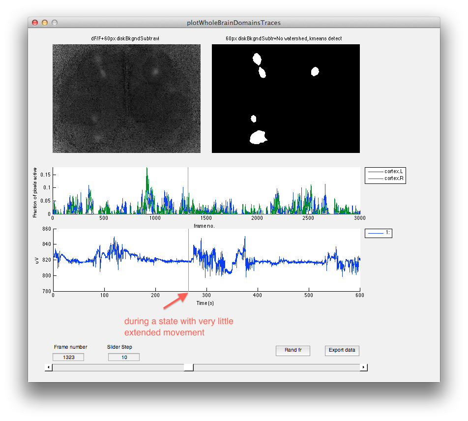
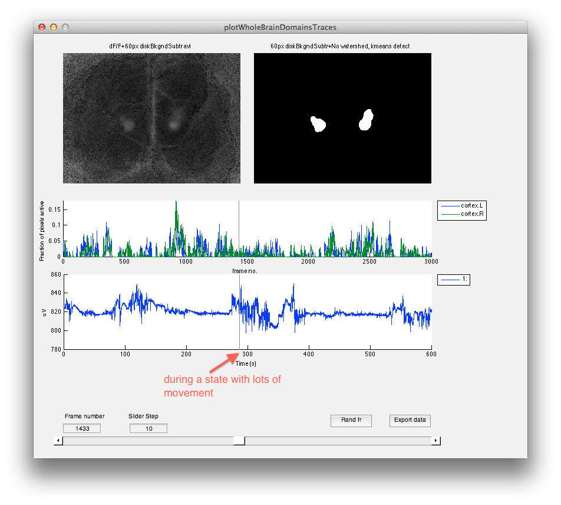
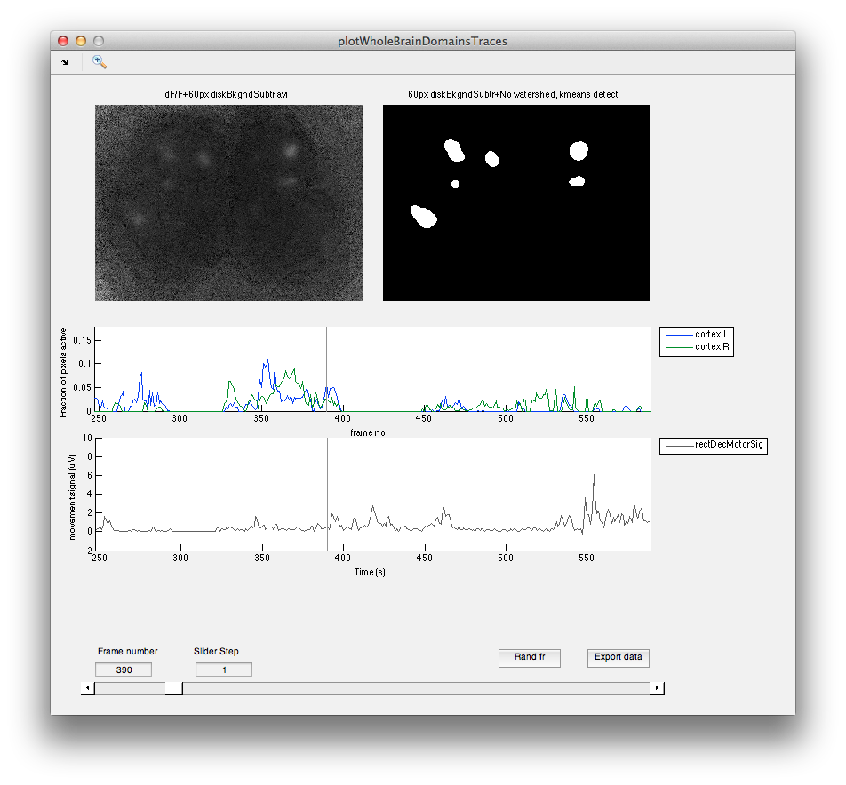

Date: 2014-02-04 10:51:07  
Author: James B. Ackman  
Tags: analysis, wholeBrain, programming, matlab 

# wholeBrain workflow

## Prep files

* (1) Open the AVG .tif movie image (can be a tiff, jpg, png) (likely saved previously with a dFoF.avi for each raw .tif movie) and make brain hemisphere outlines (e.g. cortex.L, cortex.R, OB.L, OB.R, SC.L, SC.R) for each file and save the roi set as a .zip file from ImageJ (select all in ROI manager --> More --> Save). Can also use additional map images (timeColorMap Projections, domain frequency, duration, or diameter) to make outlines of functional brain region parcellations. The following macro code snippets can be copied and run from the ImageJ macro interpreter in Fiji to ease this process:  

	```javascript
	//Flip ImageJ ROI horizontally
	//# Get max xcoord value for horizontal roi flip
	print ("\\Clear");
	getSelectionCoordinates(x,y);
	v = x;
	for (i=0; i<v.length; i++) print(v[i]);  
	//Sort and print array, get max x value
	arr = x;
	sortedValues = Array.copy(arr);
	Array.sort(sortedValues);
	Array.reverse(sortedValues);
	mx = sortedValues[0];
	print("sorted array:");
	v = sortedValues;
	for (i=0; i<v.length; i++) print(v[i]);  
	print("max value:");
	print(mx);
	//#Make array with new flipped xcoord values:
	print("new values:")
	v = Array.copy(arr);
	for (i=0; i<v.length; i++) {
	  //print(v[i]);
	  dx = mx - v[i];
	  v[i] = v[i] + 2*dx;  
	  print(v[i]);
	}
	//#Make new selection based on the flipped coords: 
	makeSelection("polygon", v, y);


	//Move ImageJ ROI horizontally
	dx = 25; //no. of pixels to move ROI
	dy = 5;
	getSelectionCoordinates(x,y);
	for (i=0; i<x.length; i++) {
	  x[i] = x[i] + dx;
	  y[i] = y[i] + dy;  
	  //print(x[i]);
	}
	makeSelection("polygon", x, y);


	//Scale ImageJ ROI
	factor = 1.97; //scaling factor
	//factor = getNumber("Factor", 0.5);
	getSelectionCoordinates(x,y);
	for (i=0; i<x.length; i++) {
		x[i] = (x[i] * factor) - 640;
		y[i] = (y[i] * factor) - 540;
	}
	makeSelection("polygon", x, y);
	```

* (2) Make space-delimited plain text list of file names 'files.txt' of the raw .tif movie filenames (1st column) and matching dummy .mat filenames (2nd column) and save in same directory as your raw movie tiff files and where your dummyAreas.mat files will be located.

	```files
	131208_01.tif 131208_01_dummyAreas.mat
	131208_02.tif 131208_02_dummyAreas.mat	
	...
	```

* (3) Bootup local copy of matlab and cd into the directory containing the files. Setup dummyAreas.mat region data structure files and add ImageJ roi coordinate outlines for the brain areas. The following code block will loop through these steps based on the number of lines in 'files.txt'. 
	* note 1: The movie's **spatial resolution** (µm/px), **temporal resolution** (frame period in seconds), and **number of frames** will be input at this stage, along with optional information.
	* note 2: A movie's average image will be asked for (e.g. one used earlier for hemisphere area outlines). This can be an 8bit or 16bit or RGB jpg, png, or tif image-- it is just stored within the data structure for illustration purposes.
	* note 3: Optional: Should pass filenames for additional tiff movie files if the movie consists of multiple 2GB tiff files. Should be passed to the '**extraFiles**' variable in the interactive dialog box as a space-delimited character vector e.g. `131208_01@001.tif 131208_01@002.tif`. The resulting 'region.extraFiles' variable will be used by *wholeBrain_segmentation.m* when reading in the movie data to concatenate the movie together:  
	* Make dummyAreas.mat files:
		
	```matlab
	%matlab
	addpath(genpath('~/Documents/MATLAB/wholeBrainDX'))
	addpath(genpath('~/Documents/MATLAB/sigTOOL'))
	addpath(genpath('~/Documents/MATLAB/piotrImageVideoProcessingToolbox'))
	%addpath(genpath('~/Documents/MATLAB/bfmatlab'))

	filelist = readtext('files.txt',' ');
	fnms = filelist(:,2);  %Second column is dummy region matfiles

	%To make dummyAreas files
	def1=[]; def2=[];
	for k = 1:numel(fnms)
		fnm = fnms{k};
		try
			load(fnm) 
		catch
			disp('dummy .mat file not found, making new region dummy file structure')
			region.image = [];
		end
		disp(['Please input required exp params for ' fnm])
		[region, ~] = dxInputParamsSetup(region, def1); %required line

		%Load brain area rois
		disp(['Please load Rois.zip file for ' fnm])
		if length(region.name) < 2, region = myReadImageJROIregionAdd(region,'false');	end 

		%Reorder area roi list of names and coordinates
		j=0;
		strOrder = {'field' 'cortex.L' 'cortex.R' 'OB.L' 'OB.R' 'SC.L' 'SC.R' 'V1.L' 'V1.R' 'V2M.R' 'V2M.L' 'V2L.R' 'V2L.L' 'A1.L' 'A1.R' 'barrel.L' 'barrel.R' 'AS.L' 'AS.R' 'PPC.L' 'PPC.R' 'LS.L' 'LS.R' 'FL.L' 'FL.R' 'HL.L' 'HL.R' 'T.L' 'T.R' 'RSA.L' 'RSA.R' 'M1.L' 'M1.R' 'M2.L' 'M2.R'};
		names2 = region.name;
		coords2 = region.coords;
		for i = 1:length(strOrder)
			idx=find(strcmp(region.name,strOrder{i}));
			if ~isempty(idx)
				j=j+1;
				names2{j} = region.name{idx};
				coords2{j} = region.coords{idx};
			end
		end
		region.name=names2;
		region.coords=coords2;

		%Add optional info to file, can comment out this line
		disp(['Please input optional exp params for ' fnm])
		%[region, def2] = dxInputParamsOpt(region, def2); %optional line

		save(fnm,'region')
		clear region 
	end
	```

* (4) Optional:  Domain tagging
	* Uses d2r.mat files from a previous batch run and `domainTaggingGui`
		* Option 1: If each recording is the same exact FOV, can do domainTagging for one with artifacts, and use borders for rest of movies in a for loop
		* Option 2: Or can do multiple movies and manually concatentate the borders together for a merged set of borders
	* (4a) Optional tagging for individual files:
	
	```matlab
	filelist = readtext('files.txt',' ');
	fnms = filelist(:,2);  %Second column is dummy region matfiles

	%====Domain Tagging 2014-01-24 15:34:35==============================
	%Do domain artifact detection tagging and duration plotting
	%Do batches of files that you may want to have the same xy positions on the blackout list
	%
	% Option 1: If each recording is the same exact FOV, can do domainTagging for one with artifacts, and use borders for rest of movies in a for loop
	% Option 2: Or can do multiple movies and manually concatentate the borders together for a merged set of borders
	% 		* Could also implement an xy shift strategy for the border coords for movie to movie shifts in FOV, but probably safer to do over for each shift in movie FOV
	%

	% For individual files:
	k = 1;  %Change no. to the fnms in list you want to use. 
	disp(['Please load the region d2r data file for ' fnms{k}])
	%load previous region data file with domains tagged or use domainTaggingGui to fetch data().frame() xy centroid locations for artifacts
	[filename, pathname] = uigetfile({'*d2r.mat'}, 'Choose region data file to open');
	f = fullfile(pathname,filename);
	load(f);
	domainTaggingGui(region,'pixelFreq') %Can change 2nd vargin to any of {'pixelFreq', 'domainFreq', 'domainDur', 'domainDiam', or 'domainAmpl'}

	load(fnms{k},'region')   %load new dummyAreas file
	if exist('taggedCentrBorders','var')
		if isfield(region, 'taggedCentrBorders')
			region.taggedCentrBorders = [region.taggedCentrBorders taggedCentrBorders];
		else
			region.taggedCentrBorders = taggedCentrBorders;
		end
		save(fnms{k},'region')  %save new dummyAreas file with the marked borders for tagging
	end
	```
	
	* (4b) Optional tagging for multiple files:
	
	```matlab
	% For a bunch of files:
	filelist = readtext('files.txt',' ');
	fnms = filelist(:,2);  %Second column is dummy region matfiles
	for k = 1:numel(fnms)
	%	for k = [1 6 7 8]
	%		clear data

		disp(['Please load the region d2r data file for ' fnms{k}])
		%load previous region data file with domains tagged or use domainTaggingGui to fetch data().frame() xy centroid locations for artifacts
		[filename, pathname] = uigetfile({'*d2r.mat'}, 'Choose region data file to open');
		fnm = fullfile(pathname,filename);
		load(fnm);
		domainTaggingGui(region)	
		h = gcf;
		waitfor(h)
		save(fnm,'region')

	%Optional, domainsPatchesPlot (doesn't work on hpc):  
	%	for plotType = [1 3 4 5];
	%		fnm2 = [fnm(1:end-4) 'domainPatchesPlot' datestr(now,'yyyymmdd-HHMMSS') '.mat'];
	%		DomainPatchesPlot(region.domainData.domains, region.domainData.CC, region.domainData.STATS,plotType,[],1,region)
	%		print(gcf, '-dpng', [fnm2(1:end-4) '-' datestr(now,'yyyymmdd-HHMMSS') '.png']);      
	%		print(gcf, '-depsc', [fnm2(1:end-4) '-' datestr(now,'yyyymmdd-HHMMSS') '.eps']);
	%		end
	end	
	```

* (5) Optional:  
	* Run `sigTOOL` from matlab and use `Batch Import` in the sigTOOL gui to convert each Spike2.smr file into a .kcl data file for use with sigTOOL for simultaneously acquired signals like motorSignal from photodiode or electrophysiology signals.  
		* Export motor signal from Spike2.smr file, make filtered signal for dummyfile, and detect motor active periods and save in dummyfile for each movie  
		* Add other stimuli info to dummy file, using makeMotorStateStimParams.m and makeDrugStateStimParams.m  
		* Save region fnm  

	```matlab
	filelist = readtext('files.txt',' ');
	fnms = filelist(:,2);  %Second column is dummy region matfiles
	k = 0;  %Initialization only. For using the following code on multiple files in a directory
	
	%---START Add motor signal---
	k = k+1;
	fnm = fnms{k};  %***change iterator to desired filename***
	load(fnm,'region')
	
	disp(['Please load the sigTOOL .kcl data file for ' fnm])
	mySTOpen  %open each .kcl file	
	fhandle = 1;
	myBatchFilter(fhandle,1,[], 1,8,'ellip', 'band') %bandpass1 - 20Hz. The motor signal is in this band, with a little bit of respiratory rate signal (but attenuated).

	chanNum = 3;
	region = wholeBrain_motorSignal(fhandle, region, chanNum);
	print(gcf,'-dpng',[fnm(1:end-4) 'motorSignal' datestr(now,'yyyymmdd-HHMMSS') '.png'])            
	print(gcf,'-depsc',[fnm(1:end-4) 'motorSignal' datestr(now,'yyyymmdd-HHMMSS') '.eps']) 
	save(fnm,'region')

	%Detect and add motor.onsets to region.stimuli
	[index] = detectMotorOnsets(region);
	region = makeStimParams(region, index, 'motor.onsets'); 
	print(gcf,'-dpng',[fnm(1:end-4) 'motorSignal' datestr(now,'yyyymmdd-HHMMSS') '.png'])            
	print(gcf,'-depsc',[fnm(1:end-4) 'motorSignal' datestr(now,'yyyymmdd-HHMMSS') '.eps']) 

	%Detect and add motor.states to region.stimuli
	rateChan = rateChannels(region);
	print(gcf,'-dpng',[fnm(1:end-4) 'motorSignalDetect' datestr(now,'yyyymmdd-HHMMSS') '.png'])        
	print(gcf,'-depsc',[fnm(1:end-4) 'motorSignalDetect' datestr(now,'yyyymmdd-HHMMSS') '.eps']) 

	%rateChannels(5).y is the 250fr lag returned from the moving average rate channel code above for filtfilt on decY2  
	deltaspacing = 100; %in seconds  
	[motorOns, motorOffs] = detectMotorStates(region, rateChan(5).y, deltaspacing);   
	%make manual corrections using gui if needed, i.e. motorOns(1) = 1; motorOffs(1) = 123; motorOffs(4) = 3000;

	region = makeMotorStateStimParams(region, motorOns, motorOffs);
	save(fnm,'region')

	print(gcf,'-dpng',[fnm(1:end-4) 'motorSignalDetect' datestr(now,'yyyymmdd-HHMMSS') '.png'])        
	print(gcf,'-depsc',[fnm(1:end-4) 'motorSignalDetect' datestr(now,'yyyymmdd-HHMMSS') '.eps']) 
	%---END Add motor signal---

	%---------------------------------------------------------------------------
	%**Optional, if a drug movie
	region = makeDrugStateStimParams(region, [1], [3000], 'isoflurane') %where the frame indices inputs are drugOns and drugOffs
	save(fnm,'region')
	```


## Run batch analysis

* (6) Sync dummy and data files to NAS data server from local computer and to matlab location for analysis (either local PC or HPC).
* (7) Run the batch script. Perform within the folder containing the data files and 'files.txt':    

	```matlab
	%delete(gcp('nocreate')) %Only needed if using parfor. %Should be 'matlabpool close force local' for matlab versions earlier than 2014a
	%parpool(8)  %Only needed if using parfor. Change to n cpus. %Should be 'matlabpool open 8' for matlab versions earlier than 2014a
	diary on
	disp(datestr(now,'yyyymmdd-HHMMSS'))
	
	handles.makeMovies = 'all';
	%handles.makeMovies = 'some';
	handles.sigma = 3; %3px sigma for gauss smooth
	handles.pthr = 0.99; %99th percentile in histo of pixel edge signal intensities for estimating otsu's thresh on the sobel image.
	handles.backgroundRemovRadius = 60; %60px background radius for the circular element used in tophat filter
	
	wholeBrain_batch('files.txt',handles)
	disp(datestr(now,'yyyymmdd-HHMMSS'))
	diary off
	```

* Optional: Run the batch script for multiple experimental folders, using the 'files.txt' list inside each experiment folder:  

	```matlab
	% Multiple directories
	%delete(gcp('nocreate')) %Only needed if using parfor. %Should be 'matlabpool close force local' for matlab versions earlier than 2014a
	%parpool(8)  %Only needed if using parfor. Change to n cpus. %Should be 'matlabpool open 8' for matlab versions earlier than 2014a
	dirpath = '/scratch2/netid/';
	dirnames = {'folder1/'  'folder2/'  'folder3/'};
	beginT = datestr(now,'yyyymmdd-HHMMSS');
	for i = 1:length(dirnames)
	currdir = fullfile(dirpath,dirnames{i});
	cd(currdir)
	diary on
	disp(datestr(now,'yyyymmdd-HHMMSS'))
	wholeBrain_batch('files.txt')
	disp(datestr(now,'yyyymmdd-HHMMSS'))
	diary off
	end
	endT = datestr(now,'yyyymmdd-HHMMSS');
	disp(['Job start: ' beginT])
	disp(['Job end: ' endT])
	```


## Optional plots

wholeBrainActivityMapFig

* These plots are produced automatically with wholeBrain_batch.m. 
* It is used by domainTagginGui for the default 'pixelFreq' activity map for marking domains.
* To make brain activity maps for a single recording, do the following: 

```matlab
% load recording *.d2r.mat* file, `region`
mapType = 'domainFreq'; %where mapType can be any of {'pixelFreq','domainFreq','domainDur','domainDiam','domainAmpl'}
[A3proj,handles] = wholeBrainActivityMapFig(region1,[],2,1,0,[],[],mapType);
```

* If you want to compare brain activity mapTypes for two separate recordings for any of mapType = {'pixelFreq','domainFreq','domainDur','domainDiam','domainAmpl'}, perform the following steps:  

```matlab
% load 1st recording *.d2r.mat* file, set as `region1 = region;`
% load 2nd recording *.d2r.mat* file, set at `region2 = region;`

handles.figHandle = figure;
handles.axesHandle = subplot(1,2,1);
handles.clims = [];

mapType = 'domainFreq';
[A3proj1,handles] = wholeBrainActivityMapFig(region1,[],2,1,0,[],handles,mapType);
handles.axesHandle = subplot(1,2,2);
[A3proj2,handles] = wholeBrainActivityMapFig(region2,[],2,1,0,[],handles,mapType);

fnm2 = ['ActivityMapFigRawProj-' mapType '_' datestr(now,'yyyymmdd-HHMMSS') '.mat'];              
print(gcf, '-dpng', [fnm2(1:end-4) '.png']);                  
print(gcf, '-depsc', [fnm2(1:end-4) '.eps']);
```

plotWholeBrainDomainsTraces
: gui for comparing and assessing detection and for viewing movie with motor traces  

To run plotWholeBrainDomainsTraces simply type:  

	openWholeBrainDomainsTraces

Example screenshots:  






domainTaggingGui
: gui for marking domains

domainTaggingGui:  

	domainTaggingGui(region) %will export region with STATS.descriptor for artifact domains tagging automatically


## Outline of wholeBrain_batch

* A, A2 = wholeBrainSegmentation
* A3, CC, STATS, wholeBrain_detect
* domains = DomainSegmentationAssigment(CC,STATS,'false')
* region = domains2region(domains,CC,STATS,region, hemiindices)
	
* wholeBrainActiveFraction
	* print activefraction traces
	* copy activefraction output
* Fetch region.userdata.corr using corrcoef for network correlations
* Fetch pearsons ML, AP correlations between hemispheres
* Fetch pearsons, autocorr, xcorr motor signal correlations
* plots
	* activeFraction from above
	* wholeBrainActivityMapFig
	* wholeBrain_actvFractionMotorPlot
	* corr matrix
* datasets
	* batchFetchDomainProps
	* batchFetchLocationProps
	* batchFetchLocationPropsFreq
	* batchFetchCorrData
	* batch output for motor - cortical signal xcorr  
	* batch output for ML, AP correlations  
